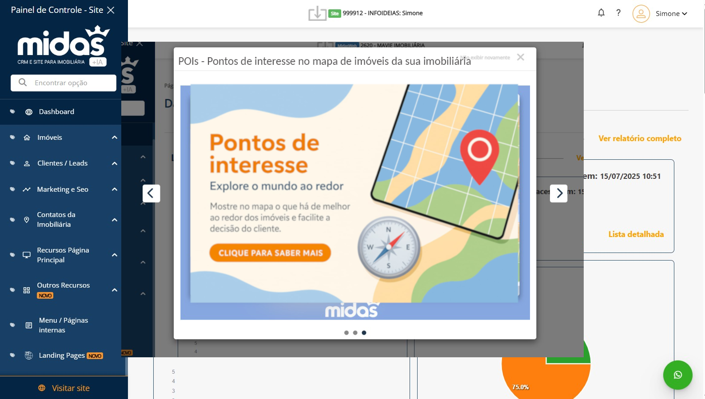
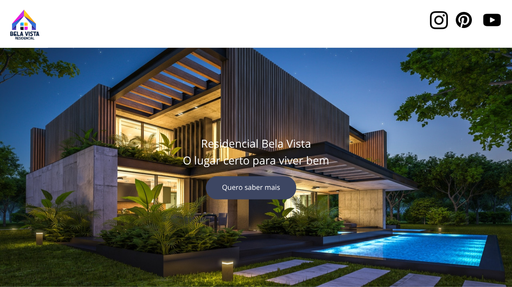
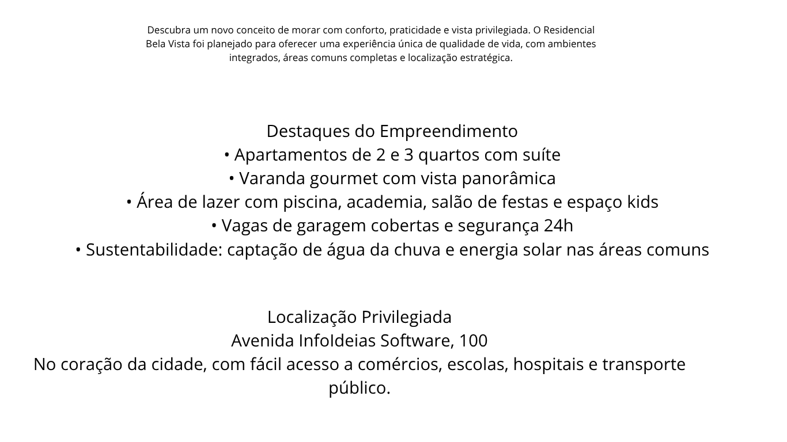
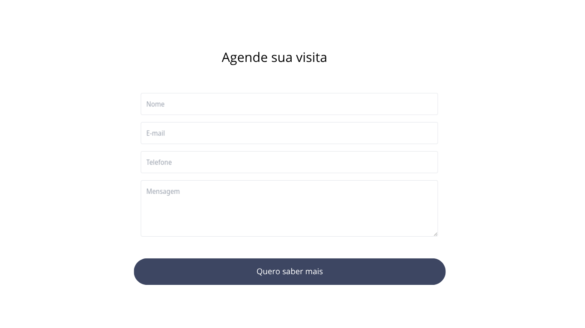

A proposta original possui uma abordagem interessante utilizando de um estilo variado com diversos elementos dispostos para criar interesse ao cliente. Entretanto, os elementos estão dispostos de maneira equivocada, sem um ponto de equilíbrio entre eles, tanto quanto em seu posicionamento quanto como na organização dentro do pop-up, deixando a desejar na questão da simetria. Além disso, o foco é comprometido pela profusão de elementos, assim como as cores utilizadas que não facilitam a legibilidade e o contraste. Pelos pontos supracitados, decidi redesenhar de uma maneira mais simples e com os elementos agora dispostos e organizados em um grau considerável de simetria, assim como o texto com um contraste maior para foco no texto e uma maior legibilidade.

### 📷 Imagens

### 📄 Landing Page
  
  
  

